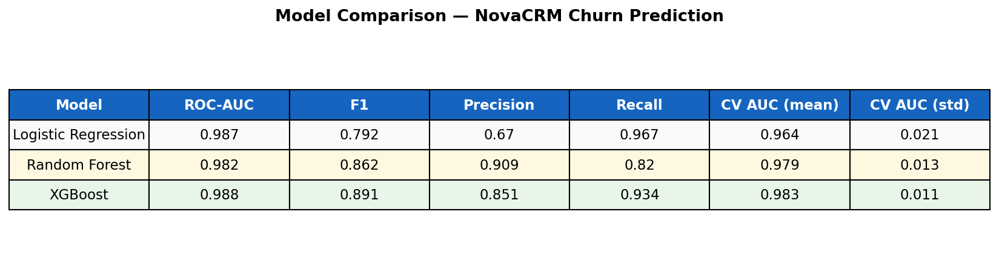
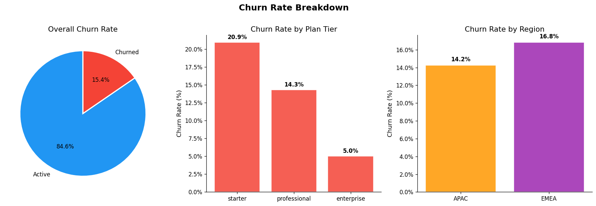
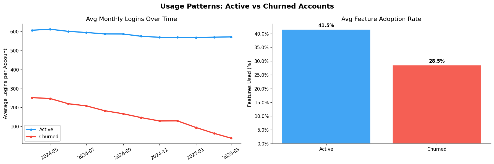
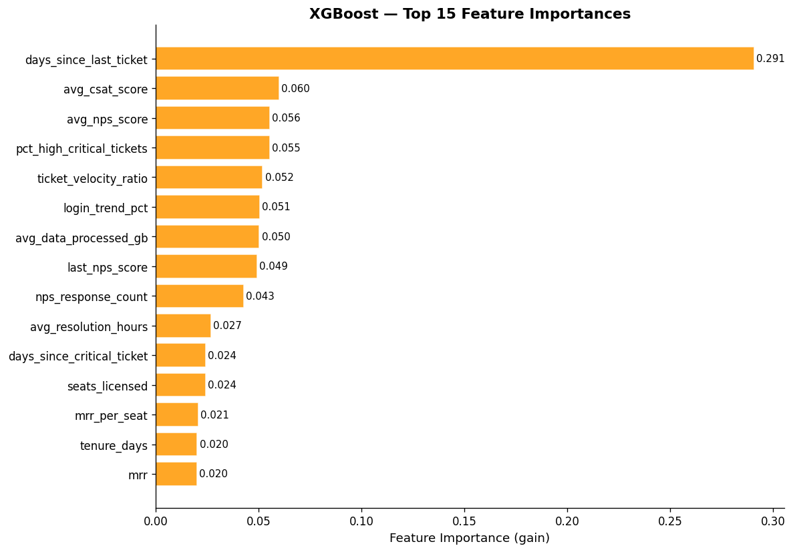
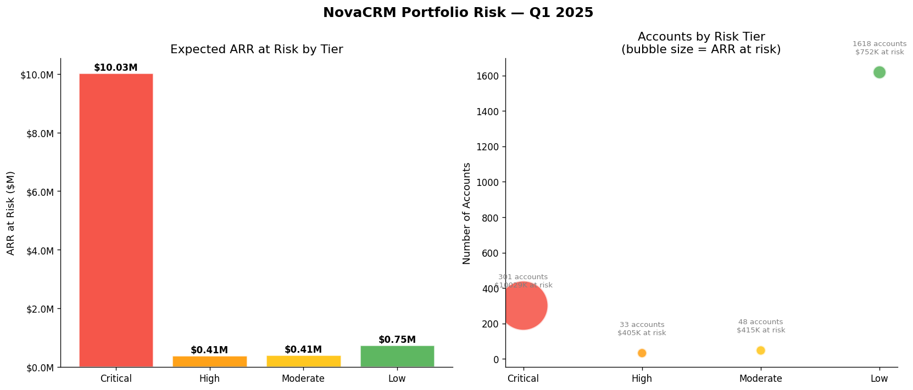
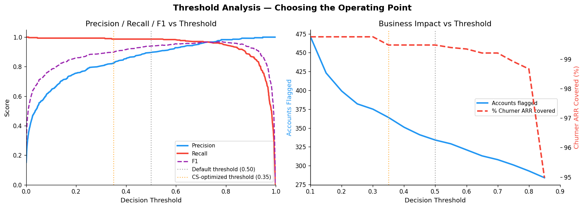

# SaaS Customer Churn Prediction

**Predicting B2B SaaS account churn to prioritize CS intervention and protect ARR**

[](https://python.org)
[](https://scikit-learn.org)
[](https://xgboost.readthedocs.io)

---

## Business Context

Customer Success teams at B2B SaaS companies face a problem: they find out an account is churning when the customer sends the cancellation email. By then it's too late.

This project builds a predictive churn model for **NovaCRM**, a fictional B2B SaaS company with 2,000 accounts and $99.5M ARR. The model identifies at-risk accounts 30–90 days before churn, giving CS teams a prioritized action list ranked by ARR at stake.

This project extends the [nova-customer-intelligence](https://github.com/erikroa/nova-customer-intelligence) dbt project, which uses rule-based health scoring. This is the next evolution: instead of hand-crafted rules, the data determines which patterns predict churn.

| Project | Approach | Tools |
|---|---|---|
| nova-customer-intelligence | Rule-based health scoring | dbt, BigQuery, SQL |
| **saas-churn-prediction** | **ML-driven predictive scoring** | **Python, scikit-learn, XGBoost** |

---

## Key Findings

- **XGBoost achieves ROC-AUC 0.988 and F1 0.891** - catching 93% of churning accounts while maintaining 85% precision
- **Top churn driver: `days_since_last_ticket`** - accounts that go quiet on support are a stronger churn signal than accounts that complain actively. Silent disengagement, not vocal frustration, predicts churn
- **334 accounts flagged for immediate CS intervention**, representing **$10.4M ARR at risk** in Q1 2025
- **Enterprise accounts churn at 5% vs 21% for Starter tier** - plan tier is a structural predictor, not just a correlation
- **Accounts without API integrations churn at significantly higher rates** - API adoption proxies switching cost and product depth

---

## The Output That Matters

The model's headline deliverable is not an AUC score - it's a **prioritized CS action list** that a CS team can pick up and act on in their Monday morning pipeline review.

| Rank | Company | Tier | CSM | Churn Prob | ARR at Risk | Action |
|---|---|---|---|---|---|---|
| 1 | [Account] | Enterprise | Sarah Chen | 94% | $285,000 | Executive escalation + QBR within 7 days |
| 2 | [Account] | Professional | Marco Ricci | 91% | $41,000 | CSM intervention call within 48 hours |
| ... | | | | | | |

Full list: [`outputs/cs_action_list.csv`](outputs/cs_action_list.csv)

---

## Model Performance

Three models were trained and compared, each serving a different business use case:

| Model | ROC-AUC | F1 | Precision | Recall | CV AUC |
|---|---|---|---|---|---|
| Logistic Regression | 0.987 | 0.792 | 0.670 | 0.967 | 0.964 |
| Random Forest | 0.982 | 0.862 | 0.909 | 0.820 | 0.979 |
| **XGBoost** | **0.988** | **0.891** | **0.851** | **0.934** | **0.983** |

**Why XGBoost wins:** It achieves the best F1, balancing precision and recall better than either baseline model. Logistic Regression catches more churners (97% recall) but generates too many false alarms for a CS team with limited capacity. Random Forest is very precise (91%) but misses too many at-risk accounts. XGBoost splits the difference.

**Choosing a threshold matters:** At the default 0.50 threshold, the model flags 334 accounts. Lowering to 0.35 increases coverage of at-risk ARR but requires more CS capacity. The threshold analysis chart shows this tradeoff explicitly so business stakeholders can choose based on team capacity.



---

## Visualizations

**Churn Distribution**


**Usage Patterns — Active vs Churned**


**Feature Importance (XGBoost)**


**ARR at Risk by Tier**


**Threshold Analysis**


---

## Methodology

### Data
2,000 synthetic B2B SaaS accounts generated to mirror realistic customer behavior patterns, with 4 tables:
- `accounts.csv` - account master data, plan tier, MRR/ARR, churn label
- `usage_metrics.csv` - monthly product usage over 12 months
- `support_tickets.csv` - individual support tickets with priority and CSAT
- `nps_surveys.csv` - quarterly NPS responses

Churn rate: **15.2%** - consistent with mid-market B2B SaaS benchmarks.

### Feature Engineering (25+ features)
Features are grouped into four dimensions:

- **Usage signals:** avg monthly logins, login trend (last 3 months vs first 3), feature adoption %, API integration flag, active user ratio
- **Support signals:** ticket velocity (recent vs historical), % high/critical tickets, avg CSAT, days since last ticket, days since last critical ticket
- **Revenue signals:** MRR, ARR, tenure days, days until renewal, MRR per seat
- **Engagement signals:** last NPS score, NPS trend across surveys, avg NPS, response count

All features are computed from data available before the churn event to prevent data leakage. The scaler is fit on training data only.

### Modeling Pipeline
```
Raw CSVs → Feature Engineering → Train/Test Split (80/20 stratified)
→ StandardScaler (fit on train only) → GridSearchCV (5-fold CV)
→ Model Evaluation → CS Action List
```

Class imbalance (85/15) is handled via `scale_pos_weight` in XGBoost and `class_weight='balanced'` in scikit-learn models.

### A Note on Synthetic Data
Synthetic data produces cleaner feature separation than production data. In a real deployment, I would expect AUC in the 0.75–0.85 range, with NPS and usage trends remaining the strongest signals but with substantially more noise from external churn causes — budget cuts, acquisitions, competitive switches — that leave no behavioral footprint in the data.

---

## Project Structure

```
saas-churn-prediction/
├── data/
│   ├── raw/                        # Generated CSVs (gitignored)
│   └── processed/
│       └── churn_features.csv      # Model-ready feature table (2,000 × 31)
├── notebooks/
│   └── 01_eda.ipynb                # Exploratory data analysis
├── src/
│   ├── generate_dataset.py         # Synthetic data generator
│   ├── build_features.py           # Feature engineering pipeline
│   ├── train_logistic.py           # Logistic regression baseline
│   ├── train_random_forest.py      # Random forest + GridSearchCV
│   ├── train_xgboost.py            # XGBoost + GridSearchCV
│   └── generate_action_list.py     # CS action list + business charts
├── outputs/
│   ├── cs_action_list.csv          # ← Headline deliverable
│   ├── model_comparison.csv        # Model metrics table
│   └── *.png                       # All visualizations
├── models/                         # Saved model artifacts (gitignored)
├── requirements.txt
└── README.md
```

---

## How to Run

```bash
# 1. Clone and set up environment
git clone https://github.com/erikroa/saas-churn-prediction.git
cd saas-churn-prediction
python -m venv venv
venv\Scripts\activate        # Windows
source venv/bin/activate     # Mac/Linux
pip install -r requirements.txt

# 2. Generate synthetic data
python src/generate_dataset.py

# 3. Build feature table
python src/build_features.py

# 4. Train models (run in order)
python src/train_logistic.py
python src/train_random_forest.py
python src/train_xgboost.py

# 5. Generate business deliverables
python src/generate_action_list.py

# 6. Explore EDA notebook
jupyter notebook notebooks/01_eda.ipynb
```

---

## Tech Stack

| Tool | Purpose |
|---|---|
| Python 3.11 | Core language |
| pandas | Data manipulation and feature engineering |
| scikit-learn | Logistic regression, Random Forest, preprocessing, model evaluation |
| XGBoost | Gradient boosting model |
| matplotlib / seaborn | Visualizations |
| Faker | Synthetic company name generation |
| Jupyter | EDA notebook |

---

## Related Projects

This project is part of a connected NovaCRM analytics portfolio:

- **[nova-customer-intelligence](https://github.com/erikroa/nova-customer-intelligence)** — dbt project with rule-based customer health scoring, 157 passing tests, Looker Studio dashboard
- **[revenue-ops-analytics](https://github.com/erikroa/revenue-ops-analytics)** — SaaS revenue analysis with BigQuery and Looker Studio
- **[SaaS-Support-Ticket-Analysis](https://github.com/erikroa/SaaS-Support-Ticket-Analysis)** — Customer support operations analysis with Python

---

*Built by Erik Roa | Revenue Operations & Customer Analytics*  
*[LinkedIn](https://linkedin.com/in/erikroa) · [GitHub](https://github.com/erikroa)*
